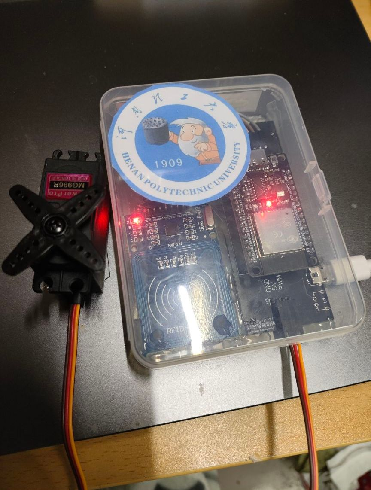
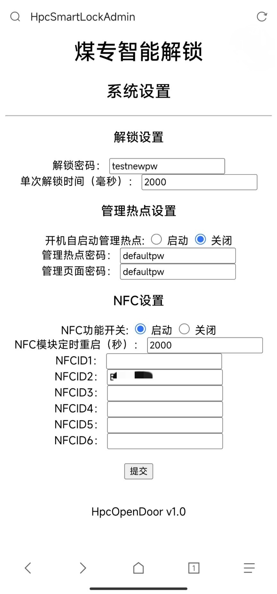
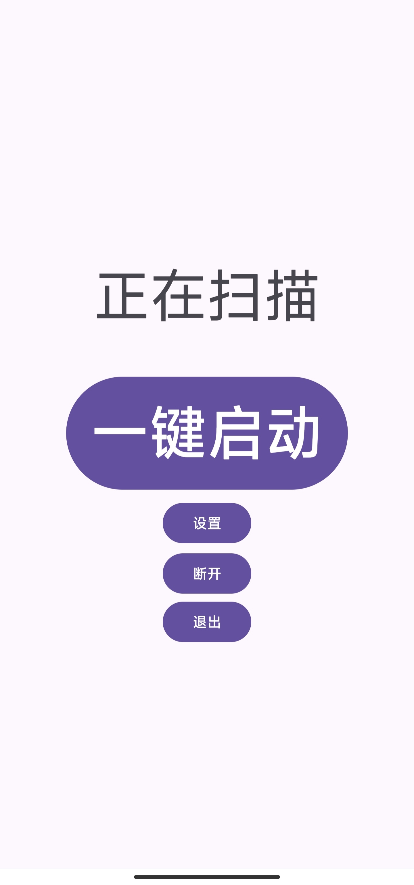
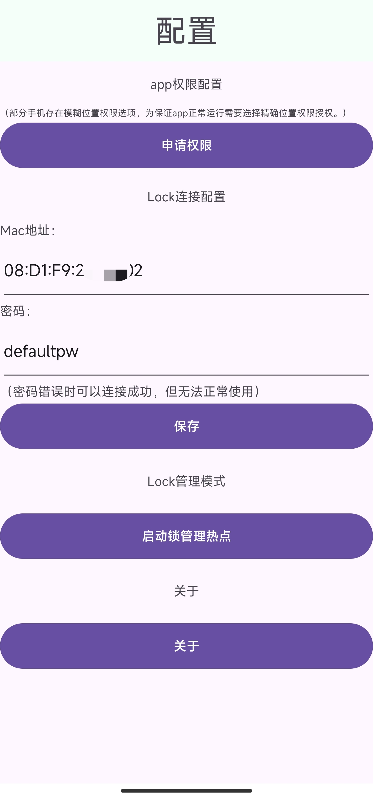

# esp32-opendoor

开学初做的宿舍开锁器，BLE蓝牙+NFC刷卡解锁，使用ESP32开发板+MFRC522+MG996舵机，5v供电，带Web管理网页可配置6个NFCID。

## 项目文件

./esp32 Arduino代码，可烧录进esp32。

./android 蓝牙解锁用的安卓app代码，apk文件会发到releases里。

./pcb 整合供电用的板子，使用嘉立创EDA绘制。

## 成品

下面pcb板用于整合供电，可以用嘉立创免费打样，接上rc522和舵机，舵机用铁丝拉动门栓。如果是木门直接贴在里面，NFC能感应。

供电用手机充电器或充电宝。

## WEB管理页

烧录好后会默认启动一个热点，连上可以访问管理页。如下图。

蓝牙需要设置解锁密码，填入app内使用。

NFC可以设置6个ID，对应ID刷卡可以开门，支持校园卡/手机NFC，苹果可以用公交卡。

## APP部分

使用BLE蓝牙解锁，管理热点关闭后可以在app内启用。

